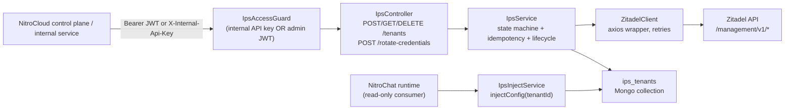
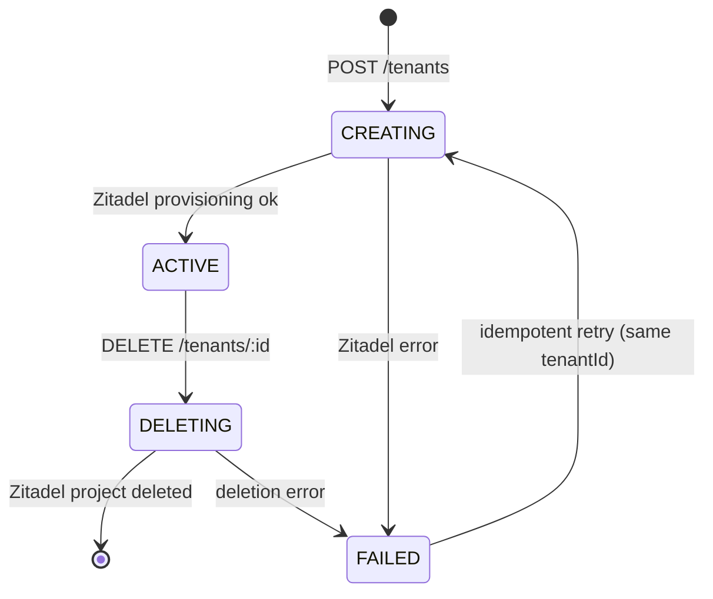

## High-level Architecture



State machine (transitions enforced in [`state/tenant-state.ts`](backend/src/zitadel/state/tenant-state.ts), `assertTransition()` throws `InvalidStateTransitionError`):



## Target layout under `backend/src/zitadel/`

- `zitadel.module.ts` — feature module; imports `MongooseModule.forFeature([IpsTenant])` and `ConfigModule`; registers controller, services, client, guard.
- `ips.controller.ts` — 4 REST endpoints (spec) + 1 internal `GET /tenants/:id/inject-config`. Guarded by `IpsAccessGuard`.
- `ips.service.ts` — orchestrator (state machine, idempotency, lifecycle, structured logging).
- `ips-inject.service.ts` — `injectConfig(tenantId)` returning `{ issuer, clientId, redirectUri }` (no secrets). Exported for in-process consumers.
- `zitadel.client.ts` — thin axios wrapper with bearer-PAT auth + exponential backoff retry on 5xx/network. Methods: `createProject(name)`, `createOIDCApp({projectId, name, redirectUris})`, `regenerateOIDCSecret(projectId, appId)`, `deleteProject(projectId)`, `getIssuer()`. URLs match real Zitadel Management API v1 (`/management/v1/projects`, `/management/v1/projects/{id}/apps/oidc`, `/management/v1/projects/{id}/apps/{appId}/oidc_config/_generate_client_secret`).
- `zitadel.config.ts` — typed config + constants (env var names, defaults, retry policy).
- `schemas/ips-tenant.schema.ts` — Mongoose `ips_tenants` collection extending `BaseSchema`. Fields: `tenantId` (unique index), `displayName`, `organizationId?`, `state` (enum), `zitadelProjectId?`, `zitadelAppId?`, `clientId?`, `clientSecret?` (redacted in responses), `issuer`, `redirectUris[]`, `lastError?`, `lastProvisionedAt?`, `retryCount`, `correlationId?`.
- `state/tenant-state.ts` — `TenantState` enum + `ALLOWED_TRANSITIONS` map + `assertTransition(from,to)`.
- `guards/ips-access.guard.ts` — accepts either valid `X-Internal-Api-Key` (compared to `IPS_INTERNAL_API_KEY`) OR Bearer JWT whose payload contains `isPlatformAdmin === true` (decoded with existing `JWT_SECRET`). Routes marked `@Public()` so the global `JwtAuthGuard` skips.
- `logging/ips-logger.ts` — structured JSON log helpers: `provisioningStart`, `provisioningSuccess`, `provisioningFailure`, `retry`, `deletionStart`, `deletionSuccess`, `rotateStart`, `rotateSuccess`. Each log line is JSON with `service:"ips"`, `event`, `tenantId`, `state`, `correlationId`, `attempt?`, `error?`.
- `errors/ips-errors.ts` — `TenantNotFoundError`, `TenantAlreadyProvisioningError`, `InvalidStateTransitionError`, `ZitadelApiError`, mapped to HTTP status via `HttpException` subclasses.
- `dto/create-tenant.dto.ts`, `dto/tenant-response.dto.ts`, `dto/rotate-credentials-response.dto.ts`, `dto/inject-config-response.dto.ts` — class-validator + Swagger decorators matching existing DTO style (see `[backend/src/nitrochat/dto/update-auth-config.dto.ts](backend/src/nitrochat/dto/update-auth-config.dto.ts)`).
- `README.md` — setup, env vars, endpoint examples, architecture explanation, verification checklist.
- `.env.example` — module-scoped example listing all `ZITADEL_*` + `IPS_*` vars.

## API surface

- `POST /api/v1/tenants` — body `{ tenantId, displayName, redirectUris[], organizationId? }`
  - Idempotency on `tenantId`:
    - new → create row in `CREATING` → call Zitadel → `ACTIVE` (or `FAILED`).
    - existing `ACTIVE` → return existing (200, `idempotent:true`, no Zitadel call).
    - existing `FAILED` → re-enter `CREATING`, retry provisioning.
    - existing `CREATING` or `DELETING` → 409.
  - Response: sanitized tenant doc + `clientSecret` exposed **once** on first successful creation.
- `GET /api/v1/tenants/:tenantId` — sanitized tenant (no `clientSecret`).
- `DELETE /api/v1/tenants/:tenantId` — transitions `ACTIVE|FAILED → DELETING`, calls `deleteProject`, soft-deletes row. Idempotent on already-deleted.
- `POST /api/v1/tenants/:tenantId/rotate-credentials` — requires `ACTIVE`. Calls `regenerateOIDCSecret`, updates row, returns new `clientSecret` once.
- `GET /api/v1/tenants/:tenantId/inject-config` — returns `{ issuer, clientId, redirectUri }`, no secret. Mirrors the in-process `IpsInjectService.injectConfig(tenantId)` used by the deployment hook.

## Config & env vars

Add to [`backend/src/config/config.module.ts`](backend/src/config/config.module.ts) Joi schema (and append to [`backend/.env.example`](backend/.env.example)):
- `ZITADEL_API_URL` (e.g. `https://zitadel.example.com`)
- `ZITADEL_PAT` (Personal Access Token for the service user)
- `ZITADEL_ORGANIZATION_ID` (Zitadel org that owns created projects; sent as `x-zitadel-orgid` header)
- `ZITADEL_DEFAULT_REDIRECT_URI` (optional fallback)
- `IPS_INTERNAL_API_KEY` (for service-to-service calls)
- `ZITADEL_HTTP_TIMEOUT_MS` (default 10000), `ZITADEL_MAX_RETRIES` (default 3)

## App-module wiring

Register `ZitadelModule` in [`backend/src/app.module.ts`](backend/src/app.module.ts) alongside the other feature modules. No existing code is mutated beyond that single import + array entry.

## Integration notes (no changes to NitroChat runtime)

The existing NitroChat provisioner in [`backend/src/nitrochat/nitrochat-instance.service.ts`](backend/src/nitrochat/nitrochat-instance.service.ts) already reads `authConfig.{clientId,authorizationEndpoint,tokenEndpoint,audience,redirectUri}` and emits `OAUTH_*` env vars (see lines ~1200–1222). The README will document the adapter pattern: a control-plane glue function calls `IpsService.createTenant(...)` then `IpsInjectService.injectConfig(tenantId)` and maps `{issuer → authorizationEndpoint/tokenEndpoint/audience, clientId, redirectUri}` into that existing `authConfig` — keeping provisioning logic fully inside IPS and NitroChat unchanged. This glue is **not** implemented (per "NitroChat must NOT contain provisioning logic") — it's just documented.

## Zitadel client — sample request structure

Example `createOIDCApp` call (real Zitadel Management API shape, not pseudo-code; full body in the actual file):

```typescript
await http.post(
  `/management/v1/projects/${projectId}/apps/oidc`,
  {
    name,
    redirectUris,
    responseTypes: ['OIDC_RESPONSE_TYPE_CODE'],
    grantTypes: ['OIDC_GRANT_TYPE_AUTHORIZATION_CODE', 'OIDC_GRANT_TYPE_REFRESH_TOKEN'],
    appType: 'OIDC_APP_TYPE_WEB',
    authMethodType: 'OIDC_AUTH_METHOD_TYPE_BASIC',
    accessTokenType: 'OIDC_TOKEN_TYPE_BEARER',
    devMode: false,
  },
  { headers: { Authorization: `Bearer ${pat}`, 'x-zitadel-orgid': orgId } },
);
```

Retry loop: up to `ZITADEL_MAX_RETRIES`, exponential backoff (250ms · 2^n + jitter), only on network errors and 5xx; 4xx fail fast and produce `ZitadelApiError`.

## Deliverables (verification-ready)

1. Every file above fully implemented (no `// TODO` / `// implement here`).
2. `backend/src/zitadel/.env.example` with all required vars.
3. `backend/src/zitadel/README.md` containing:
   - setup steps (`npm install`, config, run),
   - architecture section mirroring the two diagrams above,
   - example request/response for each endpoint (`POST /tenants`, GET, DELETE, rotate, inject-config),
   - idempotency + state-machine explanation,
   - verification checklist (state transitions, idempotency on same `tenantId`, no duplicate Zitadel projects, redacted secrets, structured logs).
4. Joi schema + root `.env.example` updated with the new vars.
5. `ZitadelModule` registered in `AppModule`.

## Explicit non-goals

- No DB migration scripts beyond Mongoose's implicit index creation.
- No unit/integration tests (no test framework wired for this module in the repo; will be called out in README).
- No changes to NitroChat runtime or its existing env-var emission.
- No OpenBao writes in this pass — `clientSecret` is stored in Mongo and redacted in responses; README documents OpenBao mirroring as a future enhancement to keep the module verifiably standalone.
