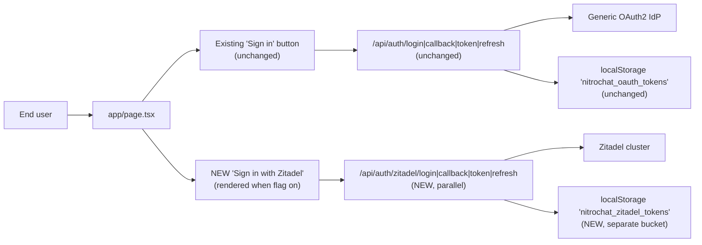

## Design principles (what stays untouched)

Per your instruction, the following files are **not modified**:

- [app/api/auth/login/route.ts](app/api/auth/login/route.ts), [app/api/auth/callback/route.ts](app/api/auth/callback/route.ts), [app/api/auth/token/route.ts](app/api/auth/token/route.ts), [app/api/auth/refresh/route.ts](app/api/auth/refresh/route.ts)
- [app/oauth/callback/page.tsx](app/oauth/callback/page.tsx)
- [lib/oauth.ts](lib/oauth.ts)
- [middleware.ts](middleware.ts)
- Existing `handleLogin` and `handleLogout` in [app/page.tsx](app/page.tsx) — new `handleZitadelLogin` / `handleZitadelLogout` sit beside them
- Existing `?accessToken=` query-param handling in [app/page.tsx](app/page.tsx) and [components/EmbedContent.tsx](components/EmbedContent.tsx) (standaloneMode)
- [lib/auth-server.ts](lib/auth-server.ts) — already provider-agnostic: it decodes any Bearer JWT and upserts by email, so Zitadel tokens go through it unchanged

## Flow map (side-by-side)



## Files to add

- [app/api/auth/zitadel/login/route.ts](app/api/auth/zitadel/login/route.ts) — POST handler. Returns `{ authorizationUrl, codeVerifier, state }`. Reads `ZITADEL_CLIENT_ID`, `ZITADEL_ISSUER`, `ZITADEL_REDIRECT_URI` (or derives from `APP_URL`). Rejects with 503 when `ZITADEL_ENABLED !== 'true'`. Re-uses PKCE helpers from [lib/oauth.ts](lib/oauth.ts) (import-only, no edits to that file).
- [app/api/auth/zitadel/callback/route.ts](app/api/auth/zitadel/callback/route.ts) — GET redirect handler. Redirects to `/?zitadel_code=…&zitadel_state=…` (mirrors the existing callback shape but with Zitadel-prefixed params so the client dispatcher in `app/page.tsx` can tell them apart).
- [app/api/auth/zitadel/token/route.ts](app/api/auth/zitadel/token/route.ts) — POST code-for-token exchange. Uses `ZITADEL_CLIENT_SECRET` + PKCE verifier. Performs optional userinfo fetch and Mongo `User` upsert (same pattern and same `models/User.ts` as the existing `/api/auth/token` route — no schema change required).
- [app/api/auth/zitadel/refresh/route.ts](app/api/auth/zitadel/refresh/route.ts) — POST refresh_token grant against Zitadel's token endpoint.
- [app/oauth/zitadel-callback/page.tsx](app/oauth/zitadel-callback/page.tsx) — client callback page mirroring [app/oauth/callback/page.tsx](app/oauth/callback/page.tsx), emitting `zitadel:success` / `zitadel:error` postMessage events and using `?zitadel_code=` / `?zitadel_state=` redirects.
- [lib/zitadel.ts](lib/zitadel.ts) — storage + helpers:
  - Keys: `nitrochat_zitadel_tokens` (localStorage), `nitrochat_zitadel_code_verifier` + `nitrochat_zitadel_state` (sessionStorage).
  - `saveZitadelTokens`, `getZitadelTokens`, `clearZitadelTokens`, `saveZitadelCodeVerifier`, `getZitadelCodeVerifier`, `clearZitadelCodeVerifier`, `saveZitadelState`, `getZitadelState`, `clearZitadelState`.
  - `refreshZitadelAccessToken()` → `POST /api/auth/zitadel/refresh`.
  - `logoutZitadel()` clears all Zitadel keys.
  - `isZitadelAuthenticated()` mirrors `isAuthenticated` from `lib/oauth.ts`.
  - PKCE helpers (`generateCodeVerifier`, `generateCodeChallenge`, `generateState`) are re-exported from `lib/oauth.ts` — we import, we do not duplicate or edit.
- [components/ZitadelLoginModal.tsx](components/ZitadelLoginModal.tsx) — structurally identical to [components/OAuthLoginModal.tsx](components/OAuthLoginModal.tsx), wired to `onLoginZitadel` prop, with Zitadel branding/label.

## Files to modify (additive only; existing logic preserved verbatim)

- [app/api/config/route.ts](app/api/config/route.ts) — add a new `mcp.zitadel` block **after** the existing `mcp.oauth` merge (line ~189). Added only when `ZITADEL_ENABLED === 'true' && ZITADEL_CLIENT_ID && ZITADEL_ISSUER`. Shape:

  ```typescript
  if (process.env.ZITADEL_ENABLED === 'true' && process.env.ZITADEL_CLIENT_ID && process.env.ZITADEL_ISSUER) {
    if (!config.mcp) config.mcp = {};
    config.mcp.zitadel = {
      enabled: true,
      issuer: process.env.ZITADEL_ISSUER,
      authorizationEndpoint: `${process.env.ZITADEL_ISSUER.replace(/\/+$/, '')}/oauth/v2/authorize`,
      tokenEndpoint: `${process.env.ZITADEL_ISSUER.replace(/\/+$/, '')}/oauth/v2/token`,
      userinfoEndpoint: `${process.env.ZITADEL_ISSUER.replace(/\/+$/, '')}/oidc/v1/userinfo`,
      clientId: process.env.ZITADEL_CLIENT_ID,
      audience: process.env.ZITADEL_AUDIENCE || process.env.ZITADEL_CLIENT_ID,
      scopes: ['openid', 'profile', 'email', 'offline_access'],
      loginLabel: process.env.ZITADEL_LOGIN_LABEL || 'Sign in with Zitadel',
    };
  }
  ```

  Existing `mcp.oauth` merge is left identical.

- [lib/store.ts](lib/store.ts) — add parallel Zustand fields and setters: `zitadelAccessToken`, `zitadelRefreshToken`, `zitadelExpiresAt`, `setZitadelTokens`, `clearZitadelTokens`. Partialize entry is extended so these are persisted alongside (not instead of) existing OAuth tokens. Existing OAuth fields untouched.

- [app/page.tsx](app/page.tsx):
  - Add `handleZitadelLogin` beside existing `handleLogin` (not a rename).
  - Add a new effect branch that handles `zitadel_code` / `zitadel_state` / `zitadel_error` query params and calls `POST /api/auth/zitadel/token` — independent of the existing `auth_code` effect.
  - Render `<ZitadelLoginModal>` / Zitadel login button **only when** `config.mcp?.zitadel?.enabled === true`, in the same places the existing login button is rendered. Existing `OAuthLoginModal` rendering is untouched.
  - Add `handleZitadelLogout` that calls `clearZitadelTokens()`, `logoutZitadel()`, and leaves existing `handleLogout` untouched. Sidebar gets an optional second logout entry rendered only when a Zitadel session exists (separate prop, default undefined).
  - Bearer-token selection for chat/MCP (currently around lines ~870–881 and ~1180–1220 per exploration) adds Zitadel as a candidate **below `?accessToken=`** (which keeps highest priority for standaloneMode) and **beside** the existing OAuth token. Priority chain:
    1. URL `?accessToken=` (unchanged — standaloneMode)
    2. Zitadel token (new)
    3. Existing OAuth token (unchanged)
    4. MCP API key (unchanged)

- [.env.example](.env.example) — append the new section (see below).
- [README.md](README.md) — append a short "Zitadel login" section explaining the flag + env vars.

## Environment variables (new, all optional)

```bash
# Feature flag — everything below is ignored when not exactly "true".
ZITADEL_ENABLED=false

# Zitadel OIDC endpoints — typically injected by NitroCloud from the IPS module.
ZITADEL_ISSUER=https://zitadel.example.com
ZITADEL_CLIENT_ID=220000000000000003@nitrocloud
ZITADEL_CLIENT_SECRET=change-me
# Optional explicit redirect. If unset, derived from APP_URL / NEXT_PUBLIC_APP_URL.
ZITADEL_REDIRECT_URI=
# Optional audience override. Defaults to ZITADEL_CLIENT_ID.
ZITADEL_AUDIENCE=
# Optional UI label shown on the Zitadel button.
ZITADEL_LOGIN_LABEL=Sign in with Zitadel
```

These map 1:1 to the IPS module's `injectConfig(tenantId)` output (`{ issuer, clientId, redirectUri }`) plus the client secret, which is delivered separately via OpenBao in real deployments.

## Feature-flag gating

- Server: every route under `app/api/auth/zitadel/*` returns **503 "Zitadel not enabled"** when `ZITADEL_ENABLED !== 'true'` or any required core var is missing. This keeps the endpoints safe even if someone toggles envs at runtime.
- Client: the new button and postMessage listener are rendered/registered only when the config fetch returns `mcp.zitadel.enabled === true`. When the flag is off, the client code paths are inert.

## Idempotency with the previous plan's assumptions

- Chat API routes (`/api/chat`, etc.) already call `getUserFromRequest` in [lib/auth-server.ts](lib/auth-server.ts), which decodes any Bearer JWT without verifying signature and upserts a `User` by email. Zitadel's ID/access tokens include `email` and `sub`, so Zitadel-auth'd sessions Just Work with no change to that file or to [models/User.ts](models/User.ts).
- `?accessToken=` (standaloneMode) stays the single highest-priority bearer source, so the deep-link embedding flow is completely unaffected.

## Explicit non-goals

- No SSR/cookie-based session (mirrors existing localStorage + Bearer approach).
- No `provider` column on `User`, no schema migration. If you later want to distinguish sessions, that's a trivial follow-up.
- No changes to [components/EmbedContent.tsx](components/EmbedContent.tsx) beyond an optional Zitadel button (see "optional" toggle below). Default scope is the main app only; I'll omit embed changes unless you want them.
- No unit tests (the project has no test framework wired).

## Deliverables

1. 6 new files under `app/api/auth/zitadel/`, `app/oauth/zitadel-callback/`, `lib/`, `components/` (all listed above).
2. 4 additive edits: [app/api/config/route.ts](app/api/config/route.ts), [lib/store.ts](lib/store.ts), [app/page.tsx](app/page.tsx), [.env.example](.env.example).
3. README section describing the flag, env vars, and UX.
4. Side-by-side verification checklist:
   - Toggle `ZITADEL_ENABLED=false` → Zitadel button invisible, `/api/auth/zitadel/*` returns 503, existing OAuth flow unchanged.
   - Toggle `ZITADEL_ENABLED=true` + vars set → Zitadel button visible beside existing login, full login → callback → token → chat round-trip works, existing OAuth flow still works in parallel (one user can have both active).
   - `?accessToken=…` in URL still wins priority over both (standaloneMode untouched).
   - Existing `handleLogout` still only clears existing OAuth; a new Zitadel logout entry handles Zitadel clear independently.
