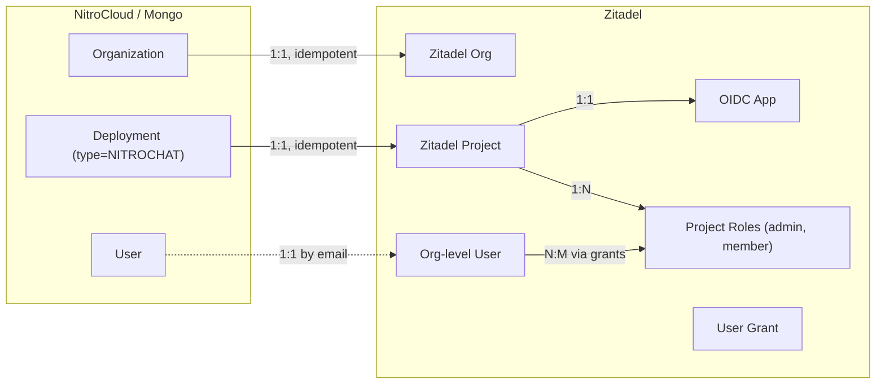
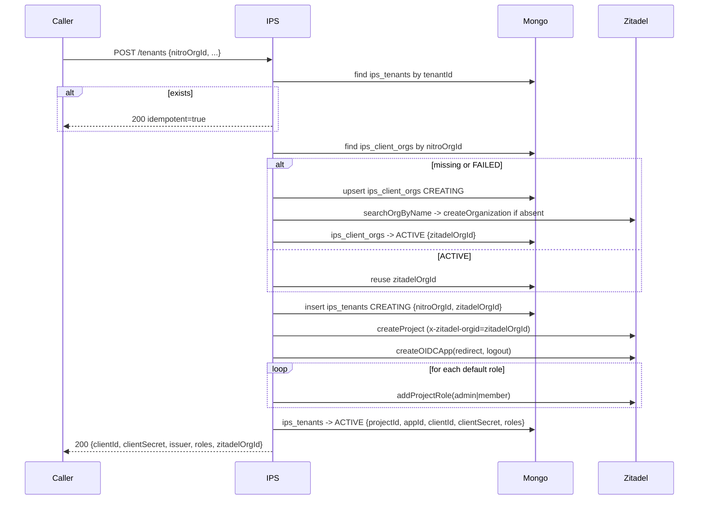

# IPS v2 — multi-tenant Zitadel provisioning

## 1. Entity mapping (authoritative)



- Client identifier on the wire: **`nitroOrgId`** = NitroCloud `Organization._id` (24-hex).
- Deployment identifier: caller-supplied `tenantId`, derived from `deployment_<Deployment._id>` by the control-plane.
- All Zitadel project/app CRUD for a given client uses that client's `zitadelOrgId` in the `x-zitadel-orgid` header, **never** the env-level `ZITADEL_ORGANIZATION_ID` (which now serves only as the bootstrap org for the IPS service user itself).

## 2. New Mongo schema — `ips_client_orgs`

New file `[nitrocloud/backend/src/zitadel/schemas/ips-client-org.schema.ts](nitrocloud/backend/src/zitadel/schemas/ips-client-org.schema.ts)`:

```typescript
@Schema({ timestamps: true, collection: 'ips_client_orgs' })
class IpsClientOrg extends BaseSchema {
  @Prop({ required: true, unique: true, index: true }) nitroOrgId: string;
  @Prop({ required: true }) zitadelOrgId: string;
  @Prop({ required: true }) zitadelOrgName: string;
  @Prop({ enum: ClientOrgState, default: ClientOrgState.CREATING, index: true }) state: ClientOrgState;
  @Prop() displayName?: string;
  @Prop() lastError?: string;
  @Prop({ default: 0 }) retryCount: number;
  @Prop() correlationId?: string;
}
```

- **Idempotency key**: unique index on `nitroOrgId`.
- **States**: `CREATING → ACTIVE → FAILED` (no `DELETING` at this level — an org is torn down only when every tenant under it is already deleted, enforced in service layer).

## 3. Evolved `ips_tenants` schema

Additive + one new required field on `[nitrocloud/backend/src/zitadel/schemas/ips-tenant.schema.ts](nitrocloud/backend/src/zitadel/schemas/ips-tenant.schema.ts)`:

- **Add**: `nitroOrgId: string` (required, indexed — foreign key to the client-org row)
- **Add**: `deploymentId?: string` (optional NitroCloud Deployment ref)
- **Add**: `zitadelOrgId: string` (required, denormalised from `ips_client_orgs` at provision time so every Zitadel call can send the correct `x-zitadel-orgid` without an extra read)
- **Add**: `logoutUris: string[]` (required by spec's App rules)
- **Add**: `roles: Array<{ key: string; displayName?: string; group?: string }>` (tracks which roles were actually seeded)
- **Keep**: all existing fields (`tenantId`, `clientId`, `clientSecret`, `issuer`, `state`, etc.)
- **Rename in DTO only**: existing `organizationId` optional field is dropped (it was a placeholder); `nitroOrgId` replaces it and becomes required.

Because v1 has never successfully provisioned anything locally, the migration is `db.ips_tenants.deleteMany({})` once in each environment before deploy. Documented in the updated README, no data script.

## 4. New Zitadel client methods

Add to `[nitrocloud/backend/src/zitadel/zitadel.client.ts](nitrocloud/backend/src/zitadel/zitadel.client.ts)`:

- `searchOrgByName(name, correlationId) -> { orgId?: string }` via `POST /management/v1/orgs/_search`
- `createOrganization(name, correlationId) -> { orgId: string }` via `POST /management/v1/orgs` (requires IAM-level PAT; upgrades the service user requirement from ORG_OWNER to **IAM_OWNER**)
- `addProjectRole(projectId, roleKey, displayName, group, correlationId)` via `POST /management/v1/projects/{id}/roles`
- `addUserGrant(userId, projectId, roleKeys[], correlationId) -> { grantId }` via `POST /management/v1/users/{userId}/grants`
- `removeUserGrant(userId, grantId, correlationId)` via `DELETE /management/v1/users/{userId}/grants/{grantId}`

All reuse the existing axios instance, retry policy, and error wrapping. Extend `ZITADEL_PATHS` in `[nitrocloud/backend/src/zitadel/zitadel.config.ts](nitrocloud/backend/src/zitadel/zitadel.config.ts)`.

Additional HTTP concern: every method gains an optional `orgId` param that overrides the default `x-zitadel-orgid` header for that single call, because project/app calls for a client must be scoped to that client's Zitadel org.

## 5. Control-plane flow — `POST /tenants`

Breaking-change contract on `[nitrocloud/backend/src/zitadel/dto/create-tenant.dto.ts](nitrocloud/backend/src/zitadel/dto/create-tenant.dto.ts)`:

```typescript
{
  nitroOrgId: string;            // REQUIRED (24-hex)
  deploymentId?: string;         // optional (24-hex)
  tenantId?: string;             // optional; defaults to `deployment_<deploymentId>`
  displayName: string;           // project display name (shown in Zitadel console)
  clientDisplayName?: string;    // used to name the Zitadel org; fallback "nc-<last6hex>-<env>"
  redirectUris: string[];        // at least 1
  logoutUris?: string[];
  roles?: Array<{ key: string; displayName?: string; group?: string }>;
                                 // defaults to [{key:"admin"},{key:"member"}]
}
```

Provisioning sequence in `[nitrocloud/backend/src/zitadel/ips.service.ts](nitrocloud/backend/src/zitadel/ips.service.ts)`:



Failure handling keeps the existing state-machine transitions (`CREATING → FAILED`). The client-org row transitions independently (`CREATING → FAILED`) — a tenant request against a FAILED client-org retries the org step automatically on next call.

## 6. New endpoints on `[nitrocloud/backend/src/zitadel/ips.controller.ts](nitrocloud/backend/src/zitadel/ips.controller.ts)`

- `POST /tenants/:tenantId/roles` — body `{ roles: RoleDto[] }` — appends additional project roles after initial provisioning. Idempotent per `roleKey`.
- `POST /tenants/:tenantId/grants` — body `{ zitadelUserId: string, roleKeys: string[] }` — creates a user→project grant in Zitadel, persists the returned `grantId` inside a new sub-document `ips_tenants.grants[]`.
- `DELETE /tenants/:tenantId/grants/:grantId` — revokes it.
- `GET /clients/:nitroOrgId` — returns `{ zitadelOrgId, zitadelOrgName, state }` for diagnostics (guarded by the same `IpsAccessGuard`).

All new endpoints use the existing `[nitrocloud/backend/src/zitadel/guards/ips-access.guard.ts](nitrocloud/backend/src/zitadel/guards/ips-access.guard.ts)` (internal key or admin JWT).

## 7. Observability

Extend `[nitrocloud/backend/src/zitadel/logging/ips-logger.ts](nitrocloud/backend/src/zitadel/logging/ips-logger.ts)` with:

- `client_org.provisioning.start / .success / .failure / .retry`
- `role.seed.success / .failure`
- `grant.issued / .revoked / .failure`

Every event retains `service`, `timestamp`, `tenantId?`, `nitroOrgId`, `correlationId`, matching v1 shape. No metrics backend in this phase — structured JSON logs only, as today.

## 8. Enforced invariants (maps to spec rules)

- **"Each client must have exactly one organization"** — `unique` on `ips_client_orgs.nitroOrgId` + transactional upsert with `retry on duplicate key` on the first write.
- **"Never duplicate projects for same deployment"** — `unique` on `ips_tenants.tenantId` (already) + default derivation `tenantId = deployment_<deploymentId>` for the happy path.
- **"Users must belong to the organization, not individual projects"** — no user creation on `POST /tenants`; users appear in Zitadel either via self-registration on the login page or via an explicit `POST /clients/:nitroOrgId/users` (not in this plan's scope; flagged as follow-up).
- **"Same user can have different roles in different projects"** — grants endpoint is per-tenant and takes `roleKeys[]`; adding a grant for the same user on a second tenant leaves the first grant untouched.
- **"Application credentials must be used only by its corresponding NitroChat instance"** — unchanged from v1: `clientSecret` is returned once in the creation response, optionally via `rotate-credentials`, never exposed by `GET /tenants/:id` or `injectConfig`.

## 9. Forbidden-list enforcement checklist

- [ ] IPS never creates a Zitadel org per tenant — verified by unique constraint on `nitroOrgId` + integration test posting two `tenants` with the same `nitroOrgId` and asserting `zitadelOrgId` equality.
- [ ] IPS never writes to `Zitadel users/human` during `POST /tenants` — verified by grepping service code for the create-user API path.
- [ ] No tenant shares a `clientId` with another — verified by unique constraint on `ips_tenants.clientId`.
- [ ] Org and project responsibilities are split between two service methods in `ips.service.ts` (`ensureClientOrg` + `provisionTenant`), each its own transaction.

## 10. Files touched (summary)

New: `schemas/ips-client-org.schema.ts`, `dto/add-role.dto.ts`, `dto/create-grant.dto.ts`.
Changed: `schemas/ips-tenant.schema.ts`, `dto/create-tenant.dto.ts`, `dto/create-tenant-response.dto.ts`, `zitadel.client.ts`, `zitadel.config.ts`, `ips.service.ts`, `ips-inject.service.ts` (read `zitadelOrgId` from tenant row, unchanged contract), `ips.controller.ts`, `zitadel.module.ts`, `logging/ips-logger.ts`, `README.md`.
Env: PAT now required to have **IAM_OWNER** (not just ORG_OWNER) — one-line update to `.env.example` and README.

## 11. Verification script (post-impl)

```bash
# 1. Provision deployment A for client X
curl -X POST $IPS/tenants -d '{"nitroOrgId":"X","tenantId":"dep-a","displayName":"A",...}'
# 2. Provision deployment B for same client X
curl -X POST $IPS/tenants -d '{"nitroOrgId":"X","tenantId":"dep-b","displayName":"B",...}'
# 3. Assert both responses share zitadelOrgId
# 4. Assert dep-a.clientId != dep-b.clientId
# 5. Grant user U admin on dep-a, member on dep-b; verify via Zitadel GET /users/U/grants
```

Success criteria from spec pass when all five assertions hold.

## Open follow-ups (flagged, not in this plan)

- End-user provisioning endpoint (`POST /clients/:nitroOrgId/users`) — needed for SCIM-style pre-seeding; not required for self-registration.
- Soft-deleting a client-org when its last tenant is deleted — requires cascading delete logic, deferred.
